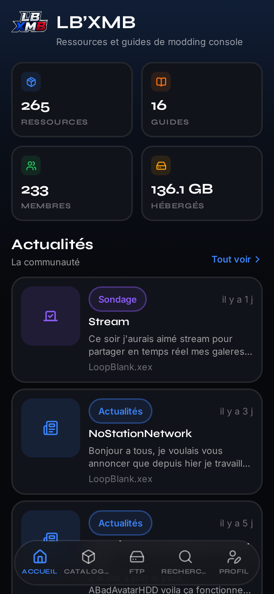
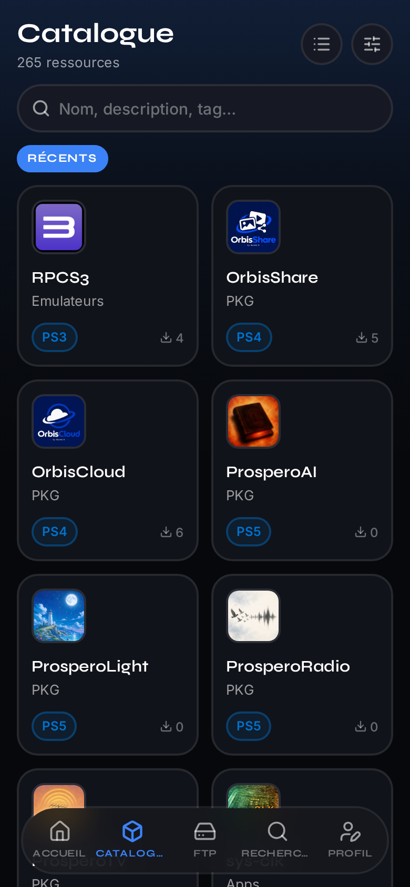
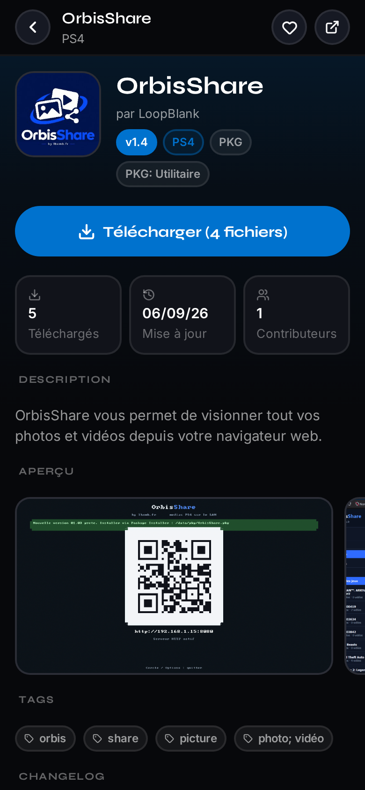
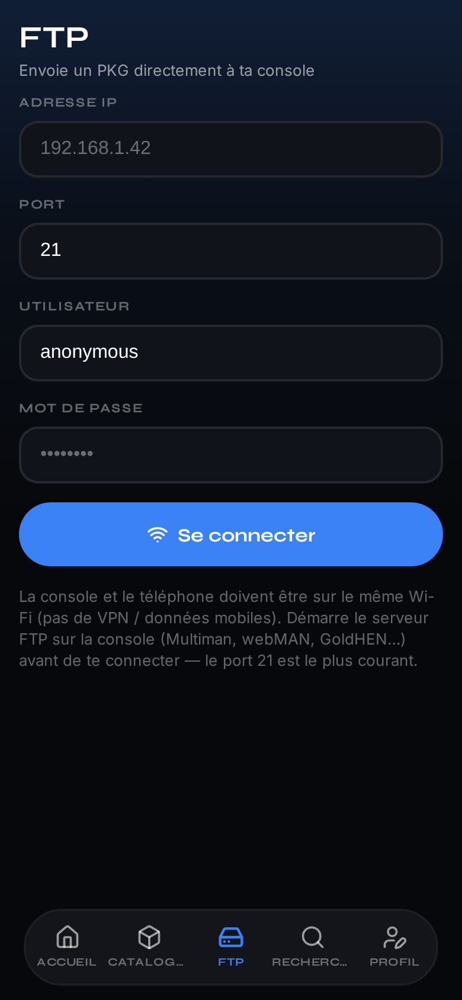
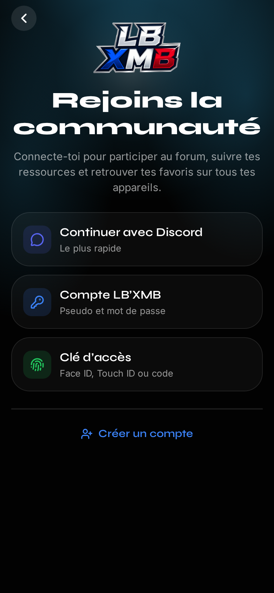
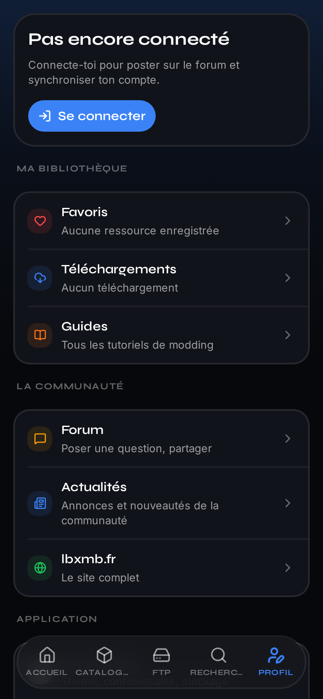
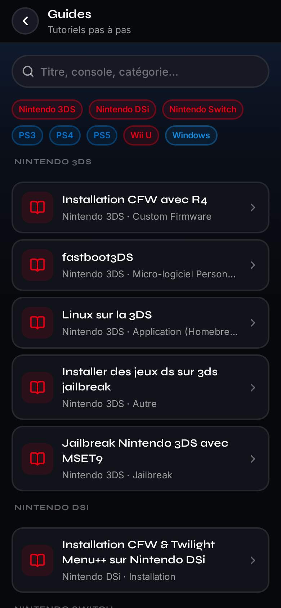
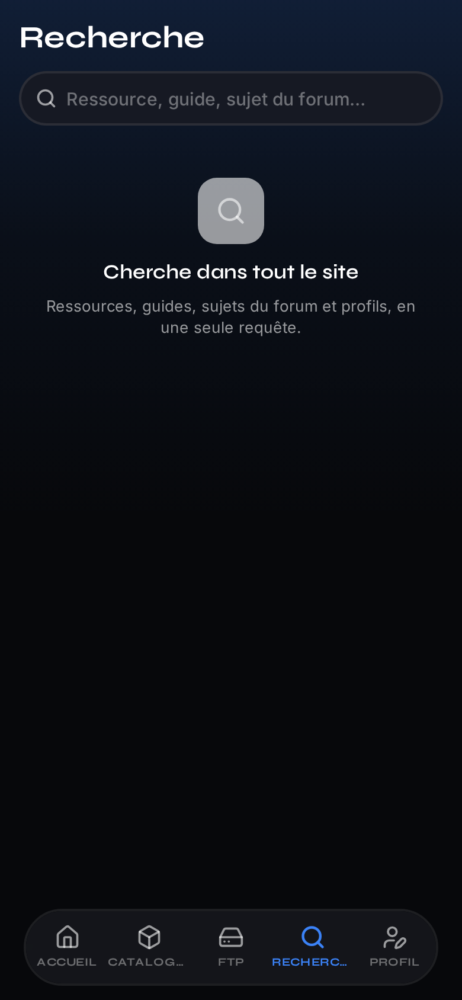

<p align="center">
  
</p>

<h1 align="center">LB’XMB — Application mobile</h1>

<p align="center">
  Français · <a href="README_EN.md">English</a>
</p>

<p align="center">
  
</p>

<p align="center">
  Le catalogue communautaire de modding console, dans ta poche.<br>
  Parcours les ressources et guides pour PlayStation, Xbox, Nintendo et PC,
  télécharge tes fichiers, envoie un PKG en FTP et garde tes favoris hors ligne.
</p>

<p align="center">
  <a href="https://lbxmb.fr"></a>
  <a href="https://lbxmb.fr/api"></a>
  <a href="https://expo.dev"></a>
  <a href="https://git.lbxmb.fr/lbxmb/app/releases"></a>
</p>

<p align="center">
  
  &nbsp;
  
  &nbsp;
  
  &nbsp;
  
</p>

<p align="center">
  
  &nbsp;
  
  &nbsp;
  
  &nbsp;
  
</p>

---

## Installation

| Plateforme | Comment faire |
|---|---|
| **Android — Obtainium** | Installe [Obtainium](https://github.com/ImranR98/Obtainium/releases), puis ouvre le badge ci-dessous. Source **Forgejo (Codeberg)**, dépôt `https://git.lbxmb.fr/lbxmb/app` (les APK sont sur [`/releases`](https://git.lbxmb.fr/lbxmb/app/releases)). |
| **Android — F-Droid** | Pas encore dans le catalogue officiel (voir [`store/fdroid.md`](./store/fdroid.md)). Obtainium couvre le même besoin. |
| **iOS — SideStore** | Sources → ajoute<br>`https://git.lbxmb.fr/lbxmb/app/raw/branch/main/store/sidestore.json`<br>IPA non signée (SideStore / AltStore / TrollStore). |
| **Manuel** | APK / IPA sur la [page des releases](https://git.lbxmb.fr/lbxmb/app/releases). |

<p align="center">
  <a href="https://apps.obtainium.imranr.dev/redirect?r=obtainium://app/%7B%22id%22%3A%22fr.lbxmb.app%22%2C%22url%22%3A%22https%3A%2F%2Fgit.lbxmb.fr%2Flbxmb%2Fapp%22%2C%22author%22%3A%22LB%27XMB%22%2C%22name%22%3A%22LB%27XMB%22%2C%22preferredApkIndex%22%3A0%2C%22additionalSettings%22%3A%22%7B%5C%22overrideSource%5C%22%3A%5C%22Codeberg%5C%22%2C%5C%22fallbackToOlderReleases%5C%22%3Atrue%2C%5C%22includePrereleases%5C%22%3Afalse%2C%5C%22apkFilterRegEx%5C%22%3A%5C%22_android%5C%5C%5C%5C.apk%24%5C%22%2C%5C%22invertAPKFilter%5C%22%3Afalse%2C%5C%22autoApkFilterByArch%5C%22%3Afalse%2C%5C%22about%5C%22%3A%5C%22Catalogue%20communautaire%20de%20modding%20console.%5C%5CnAPK%20%3A%20https%3A%2F%2Fgit.lbxmb.fr%2Flbxmb%2Fapp%2Freleases%5C%22%7D%22%7D"></a>
  &nbsp;
  <a href="sidestore://source?url=https%3A%2F%2Fgit.lbxmb.fr%2Flbxmb%2Fapp%2Fraw%2Fbranch%2Fmain%2Fstore%2Fsidestore.json"></a>
  &nbsp;
  <a href="https://git.lbxmb.fr/lbxmb/app/releases"></a>
</p>

Configs : [`store/obtainium.json`](./store/obtainium.json), [`store/sidestore.json`](./store/sidestore.json).

> **Obtainium** : ouvre le badge, ou ajoute à la main `https://git.lbxmb.fr/lbxmb/app` (**sans** `/releases`) avec la source **Forgejo (Codeberg)** (valeur JSON : `Codeberg`). Laisse *Fallback to older releases* activé : la dernière release peut ne pas avoir d’APK tant que le build Android n’a pas fini. Config : [`store/obtainium.json`](./store/obtainium.json).

## Ce que fait l’application

| | |
|---|---|
| **Accueil** | Stats communauté, ressources populaires, nouveautés et guides |
| **Catalogue** | Ressources filtrables par console / catégorie, grille ou liste |
| **Fiche ressource** | Description, galerie, lecteur vidéo (Plyr / natif), téléchargements |
| **FTP** | Envoi d’un PKG vers ta console (même Wi-Fi, serveur FTP démarré) |
| **Recherche** | Ressources, guides, forum, profils |
| **Guides** | Tutoriels rendus nativement |
| **Profil** | Compte lbxmb.fr, favoris, historique, confidentialité |

## Confidentialité

Au premier lancement : stats d’usage anonymes (Umami) ou rien du tout. Modifiable dans **Profil → Paramètres → Confidentialité**.

## Développement

### Prérequis

- Node.js 20+
- Simulateur iOS / émulateur Android / appareil
- **Development build** (modules natifs : MMKV, Reanimated, TCP, vidéo)

### Démarrer

```bash
npm install
npm run prebuild
npm run android   # ou npm run ios
```

Ensuite `npm start` suffit pour itérer.

### Scripts

| Commande | Rôle |
|---|---|
| `npm start` | Metro |
| `npm run android` / `ios` | Build + install |
| `npm run typecheck` | TypeScript |
| `npm run lint` | ESLint |
| `npm run prebuild` | Projets natifs |
| `npm run doctor` | Diagnostic deps |

### Publier

```bash
git tag v1.0.4 && git push origin v1.0.4
```

Détail : [`docs/release.md`](./docs/release.md).

### Architecture

```
app/                 Routes (Expo Router)
├── (tabs)/          Accueil, Catalogue, FTP, Recherche, Profil
├── ressource/[id]   Fiche ressource
├── guides/          Guides
└── bienvenue.tsx    Consentement

ui/                  Design system
components/          Métier (ressources, auth, forum, layout)
services/            API, téléchargements, FTP, analytics
stores/              Zustand + MMKV
```

Voir [`docs/architecture.md`](./docs/architecture.md), [`docs/api.md`](./docs/api.md), [`design/README.md`](./design/README.md).

### Stack

Expo SDK 57 · React Native 0.86 · Expo Router · TanStack Query · Zustand + MMKV · Reanimated 4 · expo-video + Plyr (YouTube) · Syne / Inter · Lucide

## Contribuer

1. `npm run typecheck && npm run lint`
2. Passer par `ui/theme` (pas de couleurs / espacements en dur)
3. Prévoir chargement / erreur / vide

Source : [git.lbxmb.fr/lbxmb/app](https://git.lbxmb.fr/lbxmb/app).

## Crédits

Interface inspirée de [Papillon](https://github.com/PapillonApp/Papillon).

<div align="center">
<sub>Fait avec ❤️ par la communauté <a href="https://lbxmb.fr">LB’XMB</a></sub>
</div>
